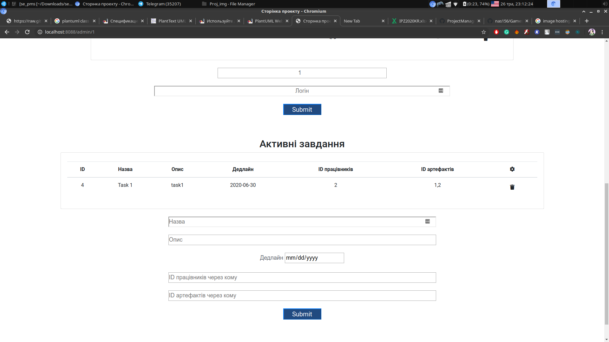

## Зміст
1. [Вступ](#вступ)
2. [Технічне завдання](#завдання)
3. [Основні положення](#теорія)
4. [Проектування](#проектування)
5. [Розробка](#розробка)
6. [Тестування](#тести)
7. [Висновки](#висновки)
8. [Джерела](#джерела)

## Вступ
**Система управління проектами** – це система, що дозволяє управляти завданнями, ролями, артефактами проектів а також відслідковувати прогрес роботи над проектами.

**Мета**
Метою документа є з'ясування основних вимог до функціональності та експлуатаційної придатності, а також визначення бізнес-правил і можливих технологічних обмежень предмета розробки.

**Системи управління проектами зазвичай створюються для:**

**1. Планування**
- планування різних подій, що залежать одна від одної;
- планування розкладу роботи співробітників і управління ресурсами;
- розрахунок часу, необхідного на вирішення кожної з задач;
- сортування завдань залежно від термінів їх завершення;
- управління декількома проектами одночасно.

**2. Управління даними та надання інформації**
- список завдань для співробітників та інформацію про розподіл ресурсів;
- огляд інформації про терміни виконання завдань;
- ранні попередження про можливі ризики, що пов'язані з проектом;
- інформація про робоче навантаження;
- інформація про хід проекту, показники і їх прогнозування.

**Реалізація**
Для реалізації проекту використовувались наступні технології та фреймворки:  MySQL, Hibernate, Thymeleaf, Spring Boot, Spring Security, Spring MVC, Spring Data JPA, Maven.

## Технічне завдання

**Загальне завдання**
Розробити вебсайт, що надає можливість створення облікового запису та подальшого створення власних проектів чи долучення до існуючих.

**Функціональність**
- користувач повинен мати можливість створити обліковий запис
- користувач повинен мати можливість створювати нові проекти
- користувач повинен мати можливість змінювати та переглядати артефакти відповідно до прав, наданих аналітиком проекту
- користувач, що є аналітиком на проекті повинен мати можливість додавати нові файли до проекту та надавати права на перегляд та зміну файлів іншим учасникам проекту
- користувач, що є аналітиком на проекті повинен мати можливість додавати нових учасників до проекту

## Основні положення
### Поняття проекту та управління проектами

**Проект** – обмежений часовими рамками процес, що має визначений початок та кінець, також може обмежуватися фінансуванням або досягненням результатів. Здійснюється для реалізації унікальних цілей та завдань, зазвичай, щоб призвести до вигідних змін або створення доданої вартості.

**Управління проектами** – область знань з планування, організації та управління ресурсами з метою успішного досягнення цілей та завершення завдань проекту.

**Головне завдання проектного управління** – досягнення всіх цілей та виконання завдань проекту, з урахуванням наперед визначених обмежень проекту.

**Другорядне завдання проектного управління** – оптимізація, розподілення та інтеграція завдань, необхідних для досягнення наперед визначених цілей.

**Традиційний метод поділу** на етапи передбачає визначення послідовності дій, що мають бути завершені. В «традиційному методі» можливо визначити 5 складових розвитку проекту:

1. Ініціювання
2. Планування та розробка
3. Виконання та впровадження
4. Моніторинг та контроль
5. Завершення

**Особливості проектів, пов&#39;язаних з ПЗ:**

- Управління проектами розробки ПЗ відрізняється від традиційного унікальним процесом життєвого циклу, який включає багаторазові тестування, оновлення та зворотний зв&#39;язок з клієнтом.
- Більшість проектів, пов&#39;язаних з ІТ мають гнучкий стиль менеджменту, щоб адаптуватися до швидкого темпу сучасного бізнесу.

### Методології проектування програмного забезпечення

**«Waterfall Model» (каскадна модель)**

Одна з найстаріших, передбачає послідовне проходження пʼяти стадій від початку до кінця:

1. Проектування
2. Дизайн
3. Розробка
4. Тестування
5. Підтримка

Завдяки її жорсткості, розробка проходить швидко, вартість і термін заздалегідь визначені. Проте каскадна модель буде давати відмінний результат тільки в проектах з чітко і заздалегідь визначеними вимогами. Продукти, розроблені за цією моделлю без обґрунтованого її вибору, можуть мати недоліки, про які стає відомо лише в кінці через сувору послідовність дій. Вносити зміни можна тільки по завершенню проекту.

**«Agile Model» (гнучка методологія)**

У «гнучкій» методології розробки після кожної ітерації циклу, щоскладається з трьох частин:

1. Планування
2. Розробка
3. Тестування

Замовник може спостерігати результат і розуміти, задовольняє він його чи ні. До недоліків можна віднести те, що через відсутність конкретних формулювань результатів складно оцінити трудовитрати і вартість розробки.

Екстремальне програмування (XP) є одним з найбільш відомих застосувань гнучкої моделі на практиці.

В основі такого типу - нетривалі щоденні зустрічі - «Scrum» і регулярні збори раз в 1, 2 або 4 тижні, «Sprint».

Методологія підходить для великих або націлених на тривалий життєвий цикл проектів, що постійно адаптуються до умов ринку.

**RUP (Rational Unified Process)**

Основні принципи:

- рання ідентифікація і безперервне усунення ризиків;
- концентрація на виконанні вимог замовників;
- очікування змін у вимогах в процесі розробки;
- компонентна архітектура, реалізована і тестована на ранніх стадіях проекту;
- забезпечення якості на всіх етапах розробки;
- згуртованість команди, ключова роль належить архітекторам;

Особливість методології: ступінь формалізації може змінюватися в залежності від потреб проекту. Ітеративна модель. В кінці кожної ітерації (2 - 6 тижнів) команда досягає певних цілей, отримує проміжну, але функціональну версію кінцевого продукту.

Ітерації та етапи розвитку:

Ролі у RUP:
- конструктор - розробляє компоненти і класи, виконує блочне тестування;
- системний інтегратор - виконує інтеграцію елементів в програмні конструкції;
- архітектор - визначає структуру реалізації;
- рецензент коду - перевіряє якість програмного коду і його відповідність стандартам проекту.

Артефакти – частини проекту, що модифікуються або використовуються в ньому при роботі над остаточним програмним продуктом. 

Основні артефакти в RUP:
- модель, елемент моделі; 
- документ; 
- вихідний код, план.

Метрика - загальний термін, що позначає будь-який показник, що використовується в бізнес-аналітиці для оцінки ефективності будь-якої активності.

Класи метрик:
- просування (рядки коду, число класів, функціональні точки в ітерації, доопрацювання);
- стабільність (тип доопрацювання, мінливість вимог або виконання);
- адаптованість (витрати на доопрацювання);
- модульність (ступінь впливу доопрацювання);
- якість (швидкість виявлення дефектів, компактність, глибина спадкування, індикатор доробки);
- завершеність (час тестування на несправність);
- профіль витрат на ресурси.

**Crystal Clear методология**

Це легка гнучка методологія для невеликих команд (6-8 чоловік) для розробки додатків. Crystal Clear більше спирається на людей, ніж на процеси і ресурси.

Методологія поступається продуктивністю, але проста у використанні. Вона вимагає мінімальних зусиль для впровадження.

Основні концепції:

- часта поставка продукту
- покращення через рефлексію
- особисті комунікації
- почуття безпеки
- фокусування
- простий доступ до експертів
- якісне технічне оточення

**Спіральна модель**

Це метод життєвого циклу розробки систем SDLC, який використовується для управління ризиками, який поєднує ітераційну модель процесу розвитку.

Кожна петля спіралі є фазою в процесі розробки програмного забезпечення. Радіус спіралі показує вартість проекту, а кутовий градус представляє прогрес, досягнутий у поточній фазі

Використання спіральної моделі доречне у таких проектах:

- проекти, в яких необхідні часті випуски;
- довгострокові проекти, які неможливо здійснити через змінені економічні пріоритети;
- проекти, в яких важливий аналіз витрат та ризиків;
- проекти, які отримали б користь від створення прототипу;
- проекти з незрозумілими або складними вимогами.

 Переваги:
- Гнучкість
- Поводження з ризиками - аналіз ризиків та ітераційний процес розробки на кожній фазі покращує безпеку та додає шанси уникнути атак та поломки
- Задоволеність клієнтів - замовник зможе побачити та оцінити його продукт на кожному етапі

 Недоліки:
- Висока вартість
- Складність
- Залежність від аналізу ризиків
- Важко керувати часом – кількість фаз та покращень невідома

**DSDM (Dynamic Systems Development Model)**

Це метод Agile, що не залежить від постачальників, охоплює весь життєвий цикл проекту та надає рекомендації щодо передового досвіду щодо своєчасного, бюджетного виконання проектів, з доведеною масштабністю для вирішення проектів будь-якого розміру та для будь-якого бізнес-сектора.

Вісім принципів DSDM:

1. Зосередьтеся на потребі бізнесу
2. Доставте вчасно
3. Співпрацюйте
4. Ніколи не посягайте на якість
5. Будуйте поступово
6. Розвивайте ітераційно
7. Спілкуйтеся постійно та чітко
8. Демонструйте контроль

**FDD (Feature Driven Development)**

FDD був розроблений, щоб слідкувати за п&#39;ятьма кроковими процесами розробки, побудованим навколо дискретних проектів &quot;функції&quot;.

Життєвий цикл проекту:

1. Розробити загальну модель
2.	Побудувати список функцій
3.	Розробити план (за ознакою)
4.	Спроектувати функцію
5.	Реалізувати функцію

Основні концепції:
3. Розробити план (за ознакою)
4. Спроектувати функцію
5. Реалізувати функцію

Переваги:
- Простий процес дозволяє швидше розвиватися
- Дозволяє більшим командам постійно рухати продукти вперед
- Використовує заздалегідь визначені стандарти розвитку

 Недоліки:
- Не працює ефективно для малих проектів
- Письмова документація мала, що призводить до плутанини
- Висока залежність від провідних розробників

**JAD (Joint Application Development)**

Це процес, що використовується в області життєвого циклу методу розвитку динамічних систем (DSDM) для збору бізнес-потреб під час розробки нових інформаційних систем для компанії.JAD зосереджений навколо конструктивних робочих нарад (семінарів). Всі розробники збираються разом у кімнаті для обговорень.

Девʼять ключових кроків:

1. Визначте цілі та обмеження проекту
2. Визначення критичних факторів успіху
3. Визначте результати проекту
4. Визначте графік роботи семінару
5. Виберіть учасників
6. Підготуйте матеріал семінару
7. Організуйте заходи та вправи семінару
8. Підготуйте, інформуйте, навчайте учасників семінару
9. Координація логістики семінарів

Переваги:
- Скорочує час і витрати
- Сесії JAD допомагають об&#39;єднати експертів, даючи їм можливість поділитися своїми поглядами, зрозуміти погляди інших та розвинути почуття власності на проект

Недоліки:
- Без багатогранної підготовки до сесії JAD, цінний час професіоналів легко витратити
- Учасники семінару JAD повинні включати співробітників, здатних надати внесок у більшість відповідних областях проблеми
- Керівник семінару зобов&#39;язаний забезпечити всім учасникам  шанс висловити свою думку, ідеї та думки

**RAD (Rapid application development**)

Це концепція створення засобів розробки програмних продуктів, що приділяє особливу увагу швидкості і зручності програмування, створенню технологічного процесу, що дозволяє програмістові максимально швидко створювати комп&#39;ютерні програми. Концепцію RAD часто зв&#39;язують із концепцією візуального програмування.

Переваги RAD:

- розробка програмного забезпечення здійснюється невеликою командою розробників за термін близько трьох-чотирьох місяців шляхом використання інкрементного прототипування із застосуванням інструментальних засобів візуального моделювання та розробки.
- Технологія RAD передбачає активне залучення замовника вже на ранніх стадіях – обстеження організації, вироблення вимог до системи.

Основні принципи:

- Інструментарій повинен бути націлений на мінімізацію часу розробки
- Створення прототипу для уточнення вимог замовника
- Циклічність розробки: кожна нова версія продукту грунтується на оцінці результату роботи попередньої версії замовником
- Мінімізація часу розробки версії, за рахунок перенесення вже готових модулів і додавання функціональності в нову версію
- Команда розробників повинна тісно співпрацювати, кожен учасник повинен бути готовий виконувати кілька обов&#39;язків
- Управління проектом має мінімізувати тривалість циклу розробки

**Scrum**

Це метод управління проектами побудований на принципах управління часом. Основною особливістю є залученість в процес всіх учасників, причому у кожного учасника є своя певна роль. Суть в тому, що не тільки команда працює над вирішенням завдання, але й зацікавлені особи і їх робота не означає тільки постійний контроль.

Переваги Scrum:

- Відгук на потреби клієнта
- Зниження вартості розробки
- Задоволення від роботи
- Більше швидких доходів

Ролі у Scrum:

- Власник Продукту — людина, що повністю розуміє цінність продукту для бізнесу. Ця людина доносить потреби замовника до Команди розробки, але не відповідає за технічну сторону процесу.
- Команда розробки виконує всі технічні завдання по розробці. Команда кроссфункціональна і відповідає за аналіз, дизайн, програмування, тестування, технічну комунікацію і т. і.
- Скрам-майстер допомагає Власнику Продукту і Команді розробки виконувати роботу без перешкод і відволікаючих чинників. Вся комунікація людей поза командою з Командою розробки проходить через Скрам-Мастера.

Типи Scrum-заходів:

1. Планування Спринту (Sprint Planning) - в ньому беруть участь всі члени Скрам команди. На цьому заході презентують Продукт. Також кожен член команди може висловитися про те, що його цікавить або турбує. В ході зустрічі призначаються пріоритети і проводяться оцінки термінів.
2. Щоденний Скрам (Daily Scrum) - Скрам-заходи, які проходять щодня під час спринтів. Вони короткі (до 15 хвилин) і призначені для того, щоб спланувати денний розклад Команди розробки.
3. Огляд Спринту (Sprint Review) - демонстрація чинного продукту, розробленого під час спринту. Цей захід проходить в кінці спринту і призначений для того, щоб в подробицях показати досягнуте замовникам.
4. Ретроспектива Спринту (Sprint Retrospective) - це свого роду розтин, обговорення того, як команда впоралася під час спринту і як можна підвищити якість її роботи в майбутньому.

**XP (Extreme Programming)**

Це методологія розробки програмного забезпечення, найпопулярніша серед так званих гнучких методологій. Має на меті поліпшення якості програмного забезпечення та чутливість до змін у вимогах замовників. Як вид гнучких методологій, XP радить часті &quot;випуски&quot; програми у коротких циклах розробки, що має на меті поліпшити продуктивність праці та покращити можливості виконання вимог замовника, що змінюються.

Елементи екстремального програмування:

- парне програмування
- проведення обширної перевірки сирцевого коду
- модульне тестування всього коду
- уникання створення функціональності до того, як вона дійсно необхідна,
- простота та ясність коду
- очікування на зміну вимог замовників з плином часу
- досить часте спілкування із замовником та між самими програмістами

Потенційні недоліки цієї методології:

- нестабільні вимоги
- незадокументовані компроміси конфліктів користувачів
- відсутність загального документу дизайну програми

**LD (Lean Development)**

Це методологія розробки програмного забезпечення, що заснована на постійному прагненні до усунення всіх видів втрат, до яких призводять:

- непотрібні функції
- непотрібна переробка
- недовиконана робота
- створення дефектного продукту

Принципи Lean:

- Усунення зайвого: того, що не приносить користі
- Упор на навчання: циклічна розробка, зворотний зв&#39;язок з клієнтом
- Рішення приймаються на основі фактів, а не прогнозів
- Цілісність у всьому: від інформування замовника до рефакторінга
- Повномасштабне бачення: важливо оцінювати проект як ціле, а не частинами

### Дослідження існуючих програмних продуктів

|   | Zoho Sprint | Wrike | Confluence | Meister Task | TeamworkProjects | Easy Projects | Paymo | Quire | Talk on Task | Zenkit | Trello | Smartsheet | Mavenlink | Avaza | Monday.com | JIRA | ProWorkflow | Asana |
| --- | --- | --- | --- | --- | --- | --- | --- | --- | --- | --- | --- | --- | --- | --- | --- | --- | --- | --- |
| API | + | + | + |   | + |   |   |   |   |   | + | + | + |   | + | + |   |   |
| Безпека даних | + | + | + | + | + | + |   | + |   |   | + |   |   | + |   |   | + |   |
| Теги |   |   |   | + | + |   |   |   |   |   |   |   |   | + | + |   |   |   |
| Бесіди / чати |   |   |   |   |   |   | + | + | + |   |   |   |   |   |   |   |   | + |
| Мобільний додаток |   | + |   |   |   |   | + |   |   |   |   |   |   |   |   |   | + |   |
| Контроль версій |   | + |   |   | + |   |   |   |   |   |   |   |   |   |   | + |   |   |
| Шаблони проектів |   | + |   |   | + | + | + |   |   |   |   |   | + | + |   |   | + | + |
| Наявність метрик | + | + | + | + | + |   |   |   | + | + | + | + | + | + | + | + | + | + |
| Управлння завданнями | + | + |   |   | + |   | + |   | + | + |   | + | + | + |   |   | + | + |
| Спільне робоче поле |   | + | + | + |   |   |   | + |   |   |   |   | + |   |   |   | + |   |
| Управління артефактами | + | + |   | + |   | + | + |   |   |   | + | + | + | + |   | + | + | + |
| Підтримка кількох проектів |   |   |   |   |   |   |   |   |   |   |   | + | + |   |   |   |   |   |
| Підтримка різних методологій |   |   |   |   |   |   |   |   |   |   |   |   |   | + |   |   | + |   |

## Проектування
**Діаграма юзкейсів**

**Сценарій перегляду загальної інформації**

| Ідентифікатор: | V-INFO |
| --- | --- |
| Назва: | Перегляд інформації про проекти |
| Учасники: | Система, Незареєстрований користувач |
| Передумови: | Користувач захотів подивитись інформацію про функціональність нашої програми щодо створення програми у рамках нашого проекту |
| Результат: | Користувач отримав відповідну інформацію |
| Виключні ситуації: | В системі немає інформації про шукані проекти |
| Основний сценарій: | 1. Користувач натискає кнопку &quot;Переглянути інформацію про проекти&quot;. 2. Система показує інформацію про всі проекти користувачу. 3. Користувач натискає кнопк &quot;Пошук&quot;. 4. Система пропонує строку пошуку. 5. Користувач вводить дані про проект, що його цікавить. 6. Система перевіряє чи є шукані проекти у базі даних. 7. Система видає інформацію про шукані проекти |

**Сценарій реєстрації**

| Ідентифікатор: | RG-1 |
| --- | --- |
| Назва: | Реєстрація нового користувача |
| Участники: | Користувач; Система |
| Передумови: | Користувач вирішив зареєструватись в системі |
| Результат: | Створення нового облікового запису користувача |
| Основний сценарій: |  1. Користувач натискає кнопку[Реєстрація]. 2. Система пропонує форму &quot;Реєстрація нового користувача&quot;. 3. Користувач заповнює поля:логін,email, пароль, ім'я, прізвище. 4. Користувач підтверджує правильність введених даних. 5. Система перевіряє введені дані. 6. До бази даних додається новий запис користувача. |
| Виключні ситуації: | Переривання реєстрації, введення неправильних та повторних даних |

**Сценарій входу**

| Ідентифікатор: | LG |
| --- | --- |
| Назва: | Вхід користувача |
| Участники: | Користувач; Система |
| Передумови: | Користувач вирішив ввійти в систему |
| Результат: | Вхід в систему |
| Основний сценарій: | 1.Користувач натискає кнопку [Логін]. 2.Система пропонує форму для входу : логін, пароль. 3.Користувач заповнює поля. 4. Система провіряє введені дані та дозволяє вхід, якщо вони вірні. |
| Виключні ситуації: | Вихід з меню,введення неправильних даних |

**Сценарій перегляду проектів**

| Ідентифікатор: | PRJ-V |
| --- | --- |
| Назва: | Перегляд Проектів |
| Учасники: | Зареєстрований Користувач, Система |
| Передумови: | Зареєстрований Користувач хоче переглянути проекти, наявні в базі даних |
| Результат: | Система виводить список проектів |
| Виключні ситуації: | Зареєстрований користувач перервав процес перегляду |
| Основний сценарій: | 1. Зареєстрований Користувач входить на свою сторінку. 2. Система показує список наявних проектів. |

**Сценарій створення проекту**

| Ідентифікатор: | N-PRJ |
| --- | --- |
| Назва: | Створення нового проекту зареєстрованим користувачем |
| Учасники: | Зареєстрований користувач, система |
| Передумови: | Зареєстрований користувач вирішив створити новий проект |
| Результат: | Створення нового проекту у системі, надання користувачу прав автора |
| Виключні ситуації: | Користувач не заповнив необхідних для заповнення параметрів щодо проекту |
| Основний сценарій: | 1. Користувач натискає кнопку &quot;+&quot;. 2. Система надає Зареєстрованому користувачу форму на введення параметрів нового проекту. 3. Користувач заповнює необхідні поля та натискає кнопку &quot;Готово&quot;. 4. Система перевіряє поля на правильність заповнення. 5. Система створює проект з заданими параметрами та записує його в базу данних. 6. Система надсилає сповіщення про створення проекту Зареєстрованому користувачу, надає йому прав Автора. |

**Сценарій додавання артефактів**

| Ідентифікатор: | ADD-ARTF |
| --- | --- |
| Назва: | Додавання артефактів |
| Учасники: | Контриб&#39;ютор, Система |
| Передумови: | Контриб&#39;ютор побажав додати артефакти. |
| Результат: | Додано артефакти |
| Виключні ситуації: | Контриб&#39;ютор перервав процес додавання. |
| Основний сценарій: | 1. Контриб&#39;ютор натискає кнопку &quot;Додати артефакти&quot;. 2. Система пропонує форму &quot;Додавання нових артефактів&quot;. 3. Контриб&#39;ютор додає тип, назву артефактів, завантажує відповідні файли в систему та натискає кнопку &quot;Додати артефакти&quot;. 4. Система додає файли до бази даних проекту. 5. Система сповіщує Контриб&#39;ютора про успішне додання артефактів. |

**Сценарій редагування артефактів**

| Ідентифікатор: | ED-ARTF |
| --- | --- |
| Назва: | Редагування артефактів |
| Учасники: | Контриб&#39;ютор, Система |
| Передумови: | Контриб&#39;ютор побажав редагувати артефакти |
| Результат: | Відредаговані артефакти |
| Виключні ситуації: | Контриб&#39;ютор перервав процес редагування. |
| Основний сценарій: | 1. Контриб&#39;ютор натискає кнопку &quot;Редагувати артефакти&quot;. 2. Система пропонує форму &quot;Редагування артефактів&quot;. 3. Контриб&#39;ютор коригує артефакти та натискає кнопку &quot;Відредагувати артефакти&quot;. 4. Система заміняє файли у базі даних проекту. 5. Система виводить Контриб&#39;ютору сповіщення про успішне редагування артефактів. |

**Сценарій додавання нового контриб’ютора**

| Ідентифікатор: | ADD-CON |
| --- | --- |
| Назва: | Додавання нового контриб&#39;ютора |
| Учасники: | Система, Автор, Зареєстрований користувач. |
| Передумови: | Автор отримав запит на комміт від Зареєстрованого користувача. |
| Результат: | Додання Зареєстрованого користувача до списку контриб&#39;юторів проекту. |
| Виключні ситуації: | Відхилення запиту Автором |
| Основний сценарій: | 1. Автор натискає кнопку  &quot;Додати контрибʼюторів&quot;. 2. Система надає список запитів від Зареєстрованих користувачів. 3. Автор обирає кандидата з наданого списку та натискає кнопку &quot;Додати контрибʼютора&quot;. 4. Система змінює стан обраного користувача на Контрибʼютора поточного проекту. 5. Система надсилає Зареєстрованому користувачу сповіщення про додання до групи контрибʼюторів проекту. 6. Система виводить Автору сповіщення про успішне додання користувача до контрибʼютерів проекту. |

**Сценарій видалення контриб’ютора**

| Ідентифікатор: | RM-CON |
| --- | --- |
| Назва: | Видалення контриб&#39;ютора |
| Учасники: | Система, Автор, Контрибʼютор. |
| Передумови: | Контрибʼютор належить до списку контрибʼюторів поточного проекту. |
| Результат: | Видалення Контрибʼютора зі списку контриб&#39;юторів поточного проекту. |
| Виключні ситуації: | Переривання процесу видалення Автором |
| Основний сценарій: | 1. Автор обирає кандидата з наданого списку та натискає кнопку &quot;Видалити контрибʼютора&quot;. 2. Система позбавляє Контрибʼютора прав щодо поточного проекту. |

**Сценарій додавання задачі**

| Ідентифікатор: | ADD-TSK |
| --- | --- |
| Назва: | Додати задачу |
| Участники: | Автор; Система; |
| Передумови: | Бажання додати задачу до проекту |
| Результат: | Створення нової задачі |
| Виключні ситуації: |  Відсутність активного проекта |
| Основний сценарій: | 1.Автор в меню проекта натискає  кнопку &quot;Додати задачу&quot;. 2.Система виводить вікно створення задачі. 3.Автор вводить всі потрібні дані. 4.Система створює нову задачу. 5. Система виводить Автору сповіщення про успішне додання задачі. |

**Сценарій видалення проекту**

| Ідентифікатор: | DEL-PRJ |
| --- | --- |
| Назва: | Видалення проекту адміном |
| Учасники: | Адмін, Система, Контриб&#39;ютори |
| Передумови: | Адмін проекту вирішив видалити свій проект |
| Результат: | Видалення з бази даних проекту та усіх прав, що з ним пов&#39;язані |
| Основний сценарій: | 1. Адмін натискає кнопку &quot;Видалити проект&quot;. 2. Система видаляє права користувачів, що пов&#39;язані з цим проектом. 3. Система видаляє з бази даних проект. 4. Система виводить на екран список проектів. |
| Виключні ситуації: | Такого проекту не існую або системні похибки|

### Діаграми послідовностей

**Діаграма V-INFO**

=======
**Діаграма RG-1**

 
**Діаграма LG**

 
**Діаграма PRJ-V**

**Діаграма N-PRJ**

**Діаграма ADD-ARTF**

**Діаграма ED-ARTF**

**Діаграма ADD-CON**

**Діаграма RM-CON**

**Діаграма ADD-TSK**

**Діаграма DEL-PRJ**

### Проектування інтерфейсу

**Головна сторінка**

**Сторінка входу**

**Сторінка реєстрації**

**Сторінка користувача**

**Сторінка інформації про користувача**

**Сторінка проекту для користувача-учасника**

**Стрінка проекту для користувача-аналітика:**

## Розробка

## Тестування

## Висновки

## Джерела

1. https://uk.wikipedia.org/wiki/Управління_проєктами
2. https://www.wrike.com/project-management-guide/faq/what-is-software-project-management/
3. https://habr.com/ru/company/edison/blog/269789/
4. https://ru.wikipedia.org/wiki/Rational_Unified_Process
5. http://wnfx.ru/crystal-clear-gibkaya-metodologiya-razrabotki-prilozheniy-saytov/
6. https://uk.wikipedia.org/wiki/%D0%A1%D0%BF%D1%96%D1%80%D0%B0%D0%BB%D1%8C%D0%BD%D0%B0_%D0%BC%D0%BE%D0%B4%D0%B5%D0%BB%D1%8C
7. https://qalight.com.ua/baza-znaniy/spiralnaya-model-spiral-model/
8. https://uk.wikipedia.org/wiki/DSDM
9. https://www.agilebusiness.org/page/whatisdsdm
10. https://study.com/academy/lesson/joint-application-development-definition-phases-methodology.html
11. https://habr.com/ru/post/70424/
12. https://uk.wikipedia.org/wiki/%D0%91%D0%B5%D1%80%D0%B5%D0%B6%D0%BB%D0%B8%D0%B2%D0%B0_%D1%80%D0%BE%D0%B7%D1%80%D0%BE%D0%B1%D0%BA%D0%B0_%D0%BF%D1%80%D0%BE%D0%B3%D1%80%D0%B0%D0%BC%D0%BD%D0%BE%D0%B3%D0%BE_%D0%B7%D0%B0%D0%B1%D0%B5%D0%B7%D0%BF%D0%B5%D1%87%D0%B5%D0%BD%D0%BD%D1%8F
13. http://dss-bi.com.ua/System/rapid-application-development-rad-%D0%BC%D0%B5%D1%82%D0%BE%D0%B4%D0%BE%D0%BB%D0%BE%D0%B3%D1%96%D1%8F-%D1%88%D0%B2%D0%B8%D0%B4%D0%BA%D0%BE%D1%97-%D1%80%D0%BE%D0%B7%D1%80%D0%BE%D0%B1%D0%BA/
14. https://www.quality-assurance-group.com/scrum/
15. https://www.getapp.com/project-management-planning-software/
16. https://alternativeto.net/
17. https://www.proofhub.com/articles/top-project-management-tools-list
18. https://www.getapp.com/project-management-planning-software/a/trello/
19. https://www.getapp.com/project-management-planning-software/a/mavenlink-professional-services-automation/features/
20. https://www.getapp.com/project-management-planning-software/a/avaza/features/
21. https://www.getapp.com/project-management-planning-software/a/jira/#features
22. https://www.getapp.com/collaboration-software/a/monday-com/features/
23. https://www.getapp.com/project-management-planning-software/a/proworkflow-project-management-software/
24. https://www.getapp.com/collaboration-software/a/asana/features/
25. http://www.interface.ru/home.asp?artId=2310
26. http://www.informicus.ru/default.aspx?SECTION=6&id=73&subdivisionid=13
27. http://www.informicus.ru/default.aspx?SECTION=6&id=73&subdivisionid=7
